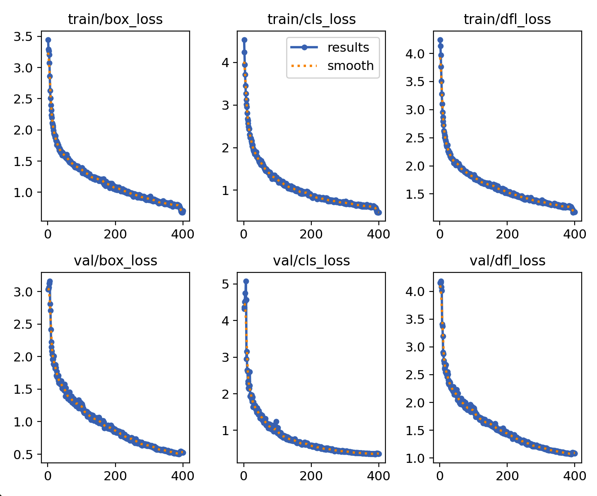

# Introduction

Travel forecasting models are based heavily on data provided by government statistical agencies, such as the US Census Bureau and the Bureau of Labor Statistics. These agencies provide the land use data needed to construct these models, giving statistics such as household number, median household income, etc. for census areas. In countries where statistical agencies are not as reliable, travel forecasting models are generally not developed or have data gaps. In countries where they are availible, these models are highly reliant on the public release of such statistical data, which leads to problems if such survies are delayed or canceled. 

Recent research has sought to find alternative methods to collect land use characterists. Gathering, analysing, and utilizing remote sensing data from satelites has been a major focus over the last several decades. Satelite aerial imagry has been used to anaylize the volume and desnity man-made sturctures and roads to estiamte area populations, in both urban and rural settings [@allaw_population_2020][@fibaek_multi-sensor_2021]. Day time imagery has also been used to track vehicle movement between major cities as an indication of economic activity [@lehnert_proxying_2023]. It has also been used to classify land use by estimating landscape patterns and building fuctions, dividing different surfaces, and then categorizing building types [@zhang_landscape_2020]. Night time light data has also been shown to be useful as well. One study coorelated city light output with social economic varibles such as population, GDp and electic power conumption [@kamarajugedda_assessing_2017], while another used the light emited from cars at night on highways to predict vehicle travel between cities [@chang_novel_2020]. Satilite imagery has also be used to produce data sets such as the Microsoft Building Footprints data set, which has been used along with LiDAR and point of interest data to inventory residentila structures from census data [@microsoft_globalmlbuildingfootprints_2026][@ye_enhancing_2024].

With the rise of commercially availible and affordable aerial drones, the ability to capture remote sensing data such as high quality aerial imagery has become signifigantly easier. The creation of open source softwares for drone use has also made it more accessible for use in research [@irujo_open_2023].

Though the pratcical uses, economical fessibilty, and ethical concerns of collecting the higher resolution data is still being discussed [@hall_use_2021].


More recently, with the advancement of more accessible deep learning models, machine learning has become very prelivent in analysing and classiflying remote sensing data. One of it's primary uses so far has been to analyeze large amounts of data, for such uses of tracking vehile movement between cities [@lehnert_proxying_2023], or predicting population characterists and locations of man-made structures across entire countires. [@fibaek_multi-sensor_2021] Building classification is of particular interest for collecting land use characterists. 

"You Only Look Once" (YOLO) being used to identify buildings and extract building footprints. [@nurkarim_building_2023]

[@sharma_building_2023]
- Extracting building footprints from point cloud data. Building were classified before extracting the footprints. Trains an AI model to classify


This leads to the question "can remote sensing data be used to develop land use data to supplement or replace data from statistical agencies?"
In this paper the process , 
and the results of the trained model will be compared to other cities in Utah. 


This paper presents a model that recongizes and categorizes building types based off remote sensing data and estimates household statistics for a general area. 


# Methodolgy

## Data Collection
The city of Logan, Utah was chosen for analysis. Building footprints for Logan were obtained from the Microsoft Building Footprint public dataset. This dataset allowed for easy access to building footprint data for this inital study. All analysis was run using Python 3.12 and various python packages and APIs. 

<!-- Split this up and not have it go across the page??? -->
:::{#fig-logan-clusters-map-plot layout-ncol=2 fig-env="figure*"}

{#fig-logan-b-f width=100%} <!-- fig-env="figure* (This will place the figure across both pages-->

{#fig-logan-bcp-n width=100%}

K-mean analysis for Logan, Utah

:::

With the chosen city the latitude and longitude of the official city boundries was obtained. Using this boundry, all the building footprints in the city were extracted from the Microsoft Building Footprint dataset and saved as a geojson file. The building were then classified using a simple K-mean anaylsis to differentate different sized buildings. To do this, the optimal K-mean was found using the elbow method. Using this K vlaue, a K-mean anaysis was run comparing the areas of the building footprints to their perimeters. @fig-logan-clusters-map-plot shows the distribution of different cluster types, with most of the buildings in Logan being a smaller size. 

Using the building foorprint location and the python Library "Contextily", 600 randomly chosen aerial images of building in Logan were taken from publicly availible satilite imagery and croped to focus on a single building. 200 of the images were from clusters that included only larger buildings to help balance building types in the dataset. 

## Model Training

Ultraylitics' "You Only Look Once" or YOLO model is a open source object detection model that has become very popular within do due it's accuracy and ease of use. The model is trained on images that have been previously annoatated by hand to identify the categories desired for the model to detect. The model trains itself on these images over many iterations until it is able to consistanly recongnize the different categories of objects. The YOLO model is then able to predict these categories other images using bounding boxes and probabilities of correct identification. 

Using the open source tool Label Studio, the images were mannually annotated. Every building in each picture was labeld into five building categories: Appartments, Residential, Commercial, Church, and School.

The annotated images were split into two categories. 80% of the pictures were used in training the object dection model, while 20% of the images were reserved for validation purposes. Within these image sets clusters that included larger and less common building sizes were specifically included, due to thier relativily lower likelyhood of appearing, to make sure the model would be trained on these less common building types. 

The model was run through hundreds of iterations until the model was able to  @fig-run16_results

{#fig-run16_results width=100%}


## Model Validation and Comparison

Using trained model to predicit building types in Logan Utah

Choosing cities in Utah using the American Community Survey data. Based off median income level and age of homes. 

Using the model to predict building types in other cities in utah based.


# Results and Discussion

::: {#fig-confusion-matrix-logan layout-ncol=2 fig-env="figure*"}

{#fig-logan_cm width=100%}

{#fig-logan_cm_n width=100%}

YOLO confusion matrixes for Logan, Utah.
:::

The Logan trained model was able to accurantly predicit residnetial, commercial, and apartment building types almost 100% of the time, as shown in @fig-confusion-matrix-logan. The desired outcome is to have all the numbers in a diagonal line, which would indicate that the model is predicting the category of a building that is in line with the annotations made. 

The model did underpreform wich schools and churches. This is attributed to the fact that there were very low number of images of both building types provided during model training. 

A important aspect to discuss is the model predicitng different building types where there is no building. This is seen on the far right of each graph, where the background was categorized. This error occurs from two sources. One is the annotation. Building such as backyard sheds were not identified, but the model still picked them up. Or there were times that only a fouth of a building was present in an image, and so was not annotated, but was still recongized by the model at a lower probability level. The other source of error is the quality of the photos used. The satilite images from Contextily were convient and easy to access, but were not high quality. This resulted in the model sometimes interpreting things of solid colors, such as roads and covered parking as a type of building. The second error could be solved using higher quality photos, while the first 


Confusion matrix for other analysis cities. What is the results? Was there a difference between how the model did between the cities? Was age of the house a big factor? Was income? Is there something else? 
Neither house age or house median income made a difference in the calssification of houses. 

Will it be easier to develop a model to be used at different cities, or a process for people to develop thier own models?

Talk about how this data is still subject to many of the problems the survey data still is. 
However, much of this research is supseptible to similar probelems as transporation models. Satilite remote sensing data is not consistent around the world, 

::: {#fig-confusion-matrix-logan layout-ncol=2 layout-nrow=3 fig-env="figure*"}

{#fig-logan_cm width=100%}

{#fig-logan_cm_n width=100%}

{#fig-logan_cm width=100%}

{#fig-logan_cm_n width=100%}

{#fig-logan_cm width=100%}

{#fig-logan_cm_n width=100%}

Normalized YOLO confusion matrixes
:::


```{=html}
<!-- An example of a floating figure using the graphicx package.
Note that \label must occur AFTER (or within) \caption.
For figures, \caption should occur after the \includegraphics.
Note that IEEEtran v1.7 and later has special internal code that
is designed to preserve the operation of \label within \caption
even when the captionsoff option is in effect. However, because
of issues like this, it may be the safest practice to put all your
\label just after \caption rather than within \caption{}.

Reminder: the "draftcls" or "draftclsnofoot", not "draft", class
option should be used if it is desired that the figures are to be
displayed while in draft mode.

\begin{figure}[!t]
\centering
\includegraphics[width=2.5in]{myfigure}
where an .eps filename suffix will be assumed under latex, 
and a .pdf suffix will be assumed for pdflatex; or what has been declared
via \DeclareGraphicsExtensions.
\caption{Simulation results for the network.}
\label{fig_sim}
\end{figure}

Note that the IEEE typically puts floats only at the top, even when this
results in a large percentage of a column being occupied by floats.


An example of a double column floating figure using two subfigures.
(The subfig.sty package must be loaded for this to work.)
The subfigure \label commands are set within each subfloat command,
and the \label for the overall figure must come after \caption.
\hfil is used as a separator to get equal spacing.
Watch out that the combined width of all the subfigures on a 
line do not exceed the text width or a line break will occur.

\begin{figure*}[!t]
\centering
\subfloat[Case I]{\includegraphics[width=2.5in]{box}%
\label{fig_first_case}}
\hfil
\subfloat[Case II]{\includegraphics[width=2.5in]{box}%
\label{fig_second_case}}
\caption{Simulation results for the network.}
\label{fig_sim}
\end{figure*}

Note that often IEEE papers with subfigures do not employ subfigure
captions (using the optional argument to \subfloat[]), but instead will
reference/describe all of them (a), (b), etc., within the main caption.
Be aware that for subfig.sty to generate the (a), (b), etc., subfigure
labels, the optional argument to \subfloat must be present. If a
subcaption is not desired, just leave its contents blank,
e.g., \subfloat[].


An example of a floating table. Note that, for IEEE style tables, the
\caption command should come BEFORE the table and, given that table
captions serve much like titles, are usually capitalized except for words
such as a, an, and, as, at, but, by, for, in, nor, of, on, or, the, to
and up, which are usually not capitalized unless they are the first or
last word of the caption. Table text will default to \footnotesize as
the IEEE normally uses this smaller font for tables.
The \label must come after \caption as always.

\begin{table}[!t]
% increase table row spacing, adjust to taste
\renewcommand{\arraystretch}{1.3}
if using array.sty, it might be a good idea to tweak the value of
\extrarowheight as needed to properly center the text within the cells
\caption{An Example of a Table}
\label{table_example}
\centering
% Some packages, such as MDW tools, offer better commands for making tables
% than the plain LaTeX2e tabular which is used here.
\begin{tabular}{|c||c|}
\hline
One & Two\\
\hline
Three & Four\\
\hline
\end{tabular}
\end{table}


Note that the IEEE does not put floats in the very first column
- or typically anywhere on the first page for that matter. Also,
in-text middle ("here") positioning is typically not used, but it
is allowed and encouraged for Computer Society conferences (but
not Computer Society journals). Most IEEE journals/conferences use
top floats exclusively. 
Note that, LaTeX2e, unlike IEEE journals/conferences, places
footnotes above bottom floats. This can be corrected via the
\fnbelowfloat command of the stfloats package. -->
```

# Conclusion and Future Research

The conclusion goes here.

As discussed by Hall et al., there are potential ethical problems with such data collection. It strattles the line between public and private information. This will need to be considered as further reserach is done into this area as to stay on the right side of the law.[@hall_use_2021] 


What does the future research look like?

Training models to detect other things such as cars, swing sets, patios, etc.

Creating the process to predict household types based off the collected data

Incorperating drone aerial imagery and extracing building footprints from that. 

Research into other remote sensing data and how it could be incorperated. 


<!-- conference papers do not normally have an appendix -->

# Acknowledgment {#acknowledgment}

The authors would like to thank...

# References {#references .numbered}