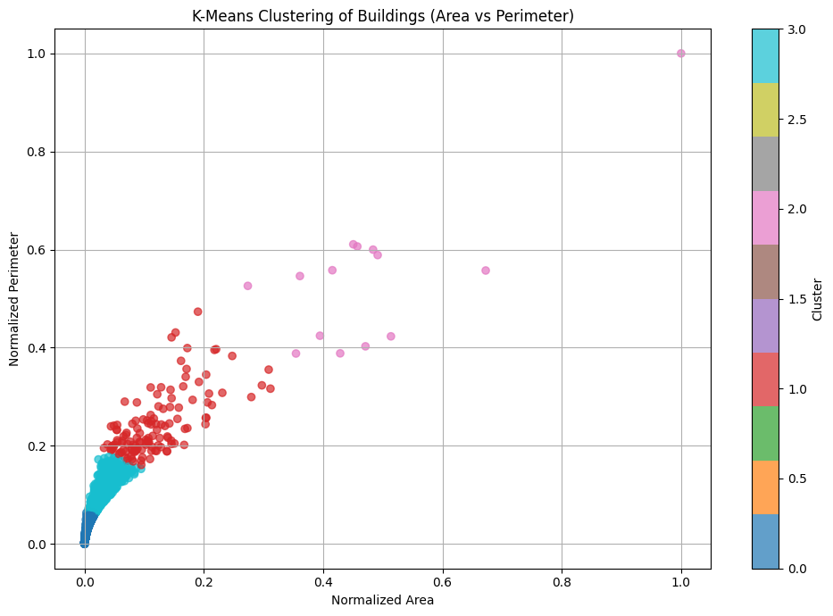
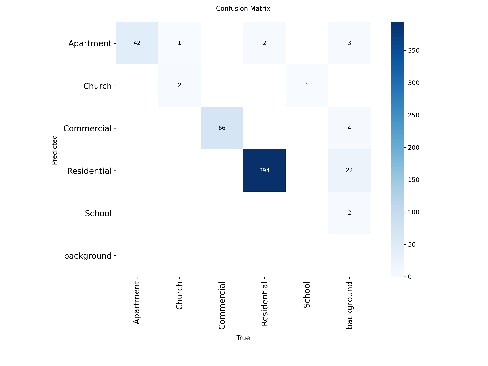
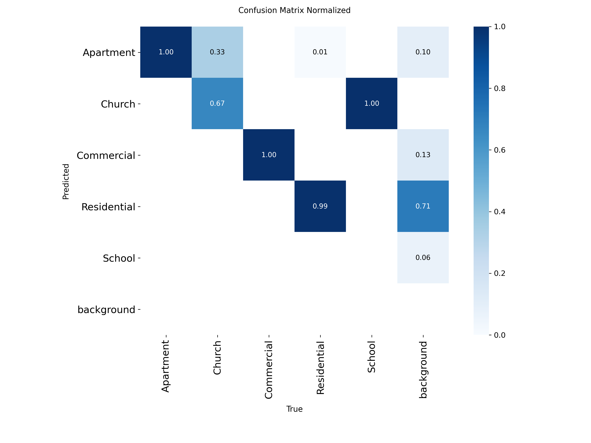
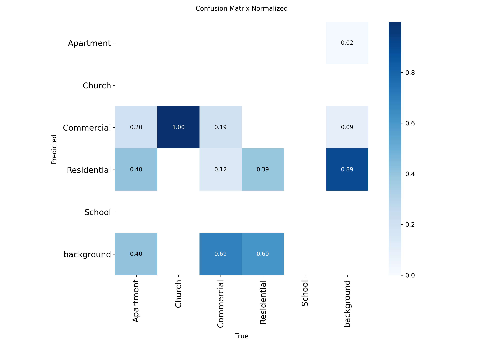
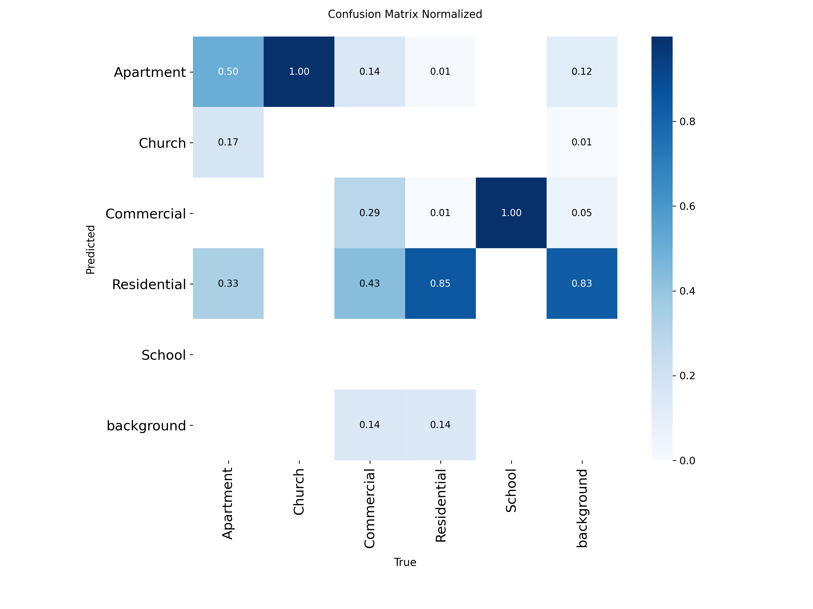
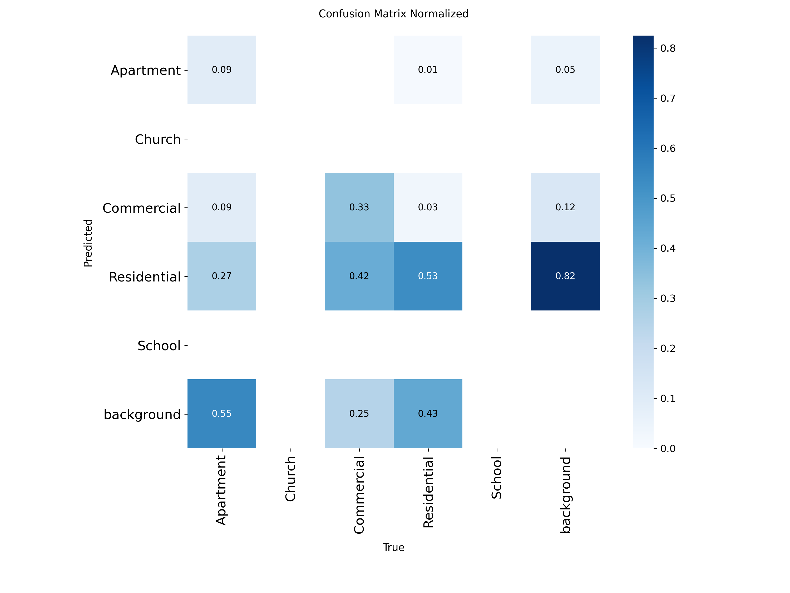
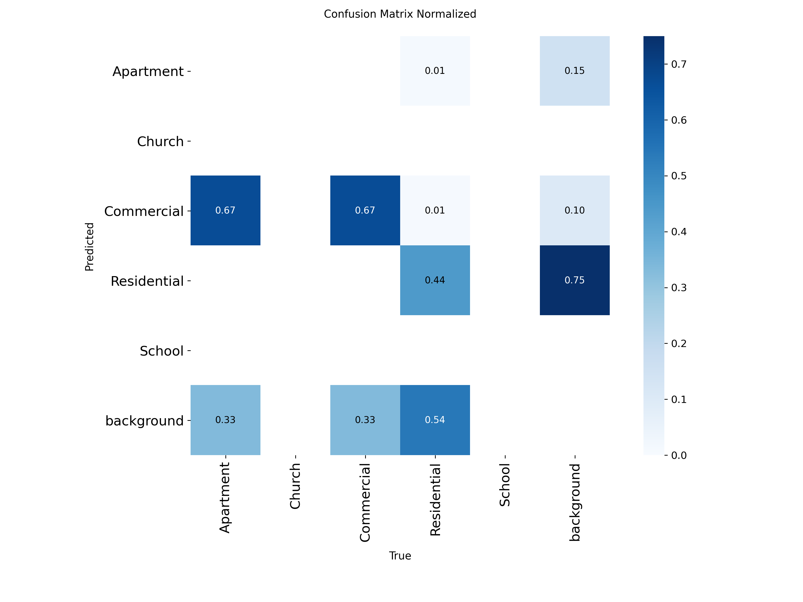

# Introduction

Travel forecasting models are based heavily on data provided by government statistical agencies, such as the US Census Bureau and the Bureau of Labor Statistics. These agencies provide the land use data needed to construct these models, giving statistics such as household number, median household income, etc. for census areas. In countries where statistical agencies are not as reliable, travel forecasting models are generally not developed or have data gaps. In countries where they are available, these models are highly reliant on the public release of such statistical data, which leads to problems if such surveys are delayed or canceled. 

Recent research has sought to find alternative methods to collect land use characteristics. Gathering, analyzing, and utilizing remote sensing data from satellites has been a major focus over the last several decades. Satellite aerial imagery has been used to analyze the volume and density man-made structures and roads to estimate area populations, in both urban and rural settings [@allaw_population_2020][@fibaek_multi-sensor_2021]. Day time imagery has also been used to track vehicle movement between major cities as an indication of economic activity [@lehnert_proxying_2023]. It has also been used to classify land use by estimating landscape patterns and building functions, dividing different surfaces, and then categorizing building types [@zhang_landscape_2020]. Night time light data has also been shown to be useful as well. One study correlated city light output with social economic variables such as population, GDP and eclectic power consumption [@kamarajugedda_assessing_2017], while another used the light emitted from cars at night on highways to predict vehicle travel between cities [@chang_novel_2020]. Satellite imagery has also be used to produce data sets such as the Microsoft Building Footprints data set, which has been used along with LiDAR and point of interest data to inventory residential structures from census data [@microsoft_globalmlbuildingfootprints_2026][@ye_enhancing_2024].

With the rise of commercially available and affordable aerial drones, the ability to capture remote sensing data such as high-quality aerial imagery has become significantly easier. The creation of open-source software’s for drone use has also made it more accessible for use in research [@irujo_open_2023].Though the practical uses, economical feasibility, and ethical concerns of collecting the higher resolution data is still being discussed [@hall_use_2021].

More recently, with the advancement of more accessible deep learning models, machine learning has become very prevent in analyzing and classifying remote sensing data. One of its primary uses so far has been to analyze large amounts of data, for such uses of tracking vehicle movement between cities [@lehnert_proxying_2023], or predicting population characterizes and locations of man-made structures across entire countries. [@fibaek_multi-sensor_2021] Building classification is of particular interest for collecting land use characterizes. Models such as "You Only Look Once" (YOLO) are being used to identify buildings and extract building footprints [@nurkarim_building_2023][@sharma_building_2023].

Within this currently research the question arises "can remote sensing data be used to develop the land use data currently obtained from statistical agencies?" The development of such a process or method would solve many problems in places without reliable statistical data as well as supplement data in other places. 

In this paper the process of collecting building footprints for a city, annotating aerial images of the buildings, and training an YOLO model to classify building types is discusses. At the end it presents research and findings into creating a model that recognizes and categorizes building types based off remote sensing data, and discusses future research into estimating household statistics for a general area. 

# Methodology

## Data Collection
The city of Logan, Utah was chosen for analysis. Building footprints for Logan were obtained from the Microsoft Building Footprint public dataset. This dataset allowed for easy access to building footprint data for this initial study. All analysis was run using Python 3.12 and various python packages and APIs. 

<!-- Split this up and not have it go across the page??? -->
:::{#fig-logan-clusters-map-plot layout-ncol=2 fig-env="figure*"}

{#fig-logan-b-f width=100%} <!-- fig-env="figure* (This will place the figure across both pages-->

{#fig-logan-bcp-n width=100%}

K-mean analysis for Logan, Utah

:::

With the chosen city the latitude and longitude of the official city boundaries was obtained. Using this boundary, all the building footprints in the city were extracted from the Microsoft Building Footprint dataset and saved as a geojson file. The building were then classified using a simple K-mean analysis to differentiate different sized buildings. To do this, the optimal K-mean was found using the elbow method. Using this K value, a K-mean analysis was run comparing the areas of the building footprints to their perimeters. @fig-logan-clusters-map-plot shows the distribution of different cluster types, with most of the buildings in Logan being a smaller size. 

Using the building footprint location and the python Library "Contextily", 600 randomly chosen aerial images of building in Logan were taken from publicly available satellite imagery and cropped to focus on a single building. 200 of the images were from clusters that included only larger buildings to help balance building types in the dataset. 

## Model Training

Ultraylitics' "You Only Look Once" or YOLO model is a open source object detection model that has become very popular within do due it's accuracy and ease of use. The model is trained on images that have been previously annotated, using bounding boxes, to identify the categories desired for the model to detect. The model trains itself on these images over many iterations until it is able to consistently recognize the different categories of objects. The YOLO model is then able to predict these categories in other images by bounding them in bounding boxes and displaying the probability of correct identification. 

Using the open source tool Label Studio, the collected street map images were manually annotated. This annotation including creating bounding boxes around the roof of each building, using best judgement based off the appearance of the building and surrounding buildings and area. The main buildings in each picture was labeled into five building categories: Apartment, Residential, Commercial, Church, and School. This order was constant across annotations.  These bounding boxes were saved as text files and each one matched up with its corresponding image. 

The annotated data sets were split into two categories. 80% of the images were used in training the object detection model, while 20% of the images were reserved for validation purposes. Within these image sets clusters that included larger and less common building sizes were specifically included, due to their relatively lower likelihood of appearing, to make sure the model would be trained on these less common building types. 

The model was run through hundreds of iterations until the model was able to accurately and reliably predict building types in Logan Utah. The model was then validated on images it had never seen to help prevent the model from "memorizing" the images. The results of the validation of the model are shown in @fig-confusion-matrix-logan.

::: {#fig-confusion-matrix-logan layout-ncol=2 fig-env="figure*"}

{#fig-logan_cm width=100%}

{#fig-logan_cm_n width=100%}

YOLO confusion matrixes for Logan, Utah.
:::

## Model Validation and Comparison

Once the model was trained and validated using the Logan, Utah data set, the model was then tested upon other cities in Utah to assess its viability in predicting building categories elsewhere in Utah. Using American Community Survey data, five other test cities were chosen based off the city's median income level, and the median age of the homes. The chosen cities can been seen in @tbl-val-cities.

::: {#tbl-val-cities .content-visible when-format="latex"}
\begin{table*}
\centering
\caption{Chosen Cities Based off Median Income and House Age}
\label{tbl-val-cities}
\renewcommand{\arraystretch}{1.3}
\begin{tabular}{lccccc}
\hline
House Age & High Income & Middle Income & Low Income  \\
\hline
Old Houses   & Bountiful, Utah    & Ogden, Utah        & Price, Utah         \\
New Houses & Saratoga Springs    & St. George, Utah         & (None)         \\
\hline
\end{tabular}
\end{table*}
:::

Following the same method as previously described, building footprint data was collected and analyzed for each city. 200 aerial images of buildings were randomly chosen and annotated. These annotated data sets were then run through the model using validation only. The results of these runs are given below in @fig-confusion-matrix-val-cities. These results were then analyses to evaluate the ability of the model to predict in other cities, as well as assess if household income or house age were indicating factors. 

# Results and Discussion
## Logan, Utah Results
The results of the Logan trained YOLO model are shown in @fig-confusion-matrix-logan. The desired output of the model is to have all the numbers in a diagonal line, which would indicate that the model is predicting the category of a building that is in line with the annotations made.  The model was able to accurately predict residential, commercial, and apartment building types almost 100% of the time. It did underperform with schools and churches. This is attributed to the fact that there were very low number of images of both building types provided during model training. Future training would seek out more images of these buildings or possibly find another way to identify them due to their rare occurrence. 

A important aspect to discuss is the model predicting different building types where there is no building. This is seen on the far right of each graph, where the background was categorized. This error occurs from two sources. One is the annotation. Building such as backyard sheds were not identified, but the model still picked them up. Or there were times that only a fourth of a building was present in an image, and so was not annotated, but was still recognized by the model at a lower probability level. The other source of error is the quality of the photos used. The satellite images from Contextily were convenient and easy to access, but were not high quality. This resulted in the model sometimes interpreting things of solid colors, such as roads and covered parking, as a type of building. The second error could be solved using higher quality photos, while the first stricter guidelines on annotation for consistency. However, in practice, error one may be less relevant if only the primary building in each image matters to be identified. 

## Other Utah Cities Results
When the Logan model was applied to other cities in Utah, it had mixed results, as seen in @fig-confusion-matrix-val-cities. In all cities, the model struggled to correctly identify the different building types. It misidentified residential building at least half of the time in most cities, with the other building types having even worse results. While it seemed to do better in Saratoga Springs with residential buildings, its accuracy with other building types is still far to low to be useful. 

The model also struggled with simply recognizing budlings at all. Each city had a significant number of buildings that were predicated as background. When the building images were individually checked, some had trees or other shadows partially covering the roof which could help explain this behavior. Yet, many of the Logan building images has similar characteristics. The image quality taken from Contextily could have played a role, yet images from both Logan and all other cities seemed to be of similar quality. So, it is uncertain whether higher quality images would have an effect on the model's accuracy in other cities. 

While it was theorized that median income or house age would play a significant factor in the model's ability to recognize different building types, this does not see to be the case. The model preformed the same in every city it was not trained on. Neither house age or house median income made a difference in classification. Relative proximity and similarity of culture also did not seem to be factors as well. 

Given the results of the validations, a process to develop a model for different locations would be more useful and viable then to create a universal model used in a wide area. It appears that building styles and types are unique enough between cities that a single unified model, at least one mostly dependent on identifying budling roofs, is not feasible. However, as will be discussed more in the future research section, adding other variables to the classification, such as the presence of sidewalks, swing sets, etc. could allow for a more general model to be developed. 

::: {#fig-confusion-matrix-val-cities layout-ncol=2 layout-nrow=3 fig-env="figure*"}

{#fig-logan_cm width=100%}

{#fig-logan_cm_n width=100%}

{#fig-logan_cm width=100%}

{#fig-logan_cm_n width=100%}

{#fig-logan_cm width=100%}

{#fig-logan_cm_n width=100%}

Normalized YOLO confusion matrixes
:::

# Conclusion and Future Research

This paper presented the results of using a deep learning model to classify building types from aerial imagery. Building footprints in Logan, Utah were used to identify buildings, images of individual buildings were used to trained a YOLO model, and that model was then tested on predicating building categories from other cities in Utah in which it was not trained on. 

Currently, this research is suspectable to many of the same problems as transportation models. Satellite and aerial imagery is not consistent around the world, having varying availability and image quality. It also may be outdated, especially in fast developing areas. The use of commercial drones could solve many of these problems, but they also come with their own. It would take some time to collect a whole city's worth of imagery, and also be dependent on the weather. There are also potential ethical problems with such data collection. It straddles the line between public and private information. This will need to be considered as further research is done into this area as to stay on the right side of the law [@hall_use_2021].

Concerning future research, this study is only in the beginning stages of development, with many potential future directions. As discussed, the model or another model could be trained to detect other objects that could be used to developed socioeconomic data, such as cars, swing sets, patios, amount of foliage or green space around house, etc. Predicted building type would become just one variable in a larger model that. Also as discussed, aerial imagery from drones could also be used acquire higher quality imagery which could improve the training and accuracy of future models. This imagery could also be used to extract building footprints. The Microsoft Building footprint data set is expansive, but not exhaustive. And it also features many notable errors in building footprint identification. 

As discussed, aerial imagery from drones 

What does the future research look like?

Training models to detect other things such as cars, swing sets, patios, etc.

Creating the process to predict household types based off the collected data

Incorporating drone aerial imagery and extracting building footprints from that. 

Research into other remote sensing data and how it could be incorporated. 

# References {#references .numbered}

