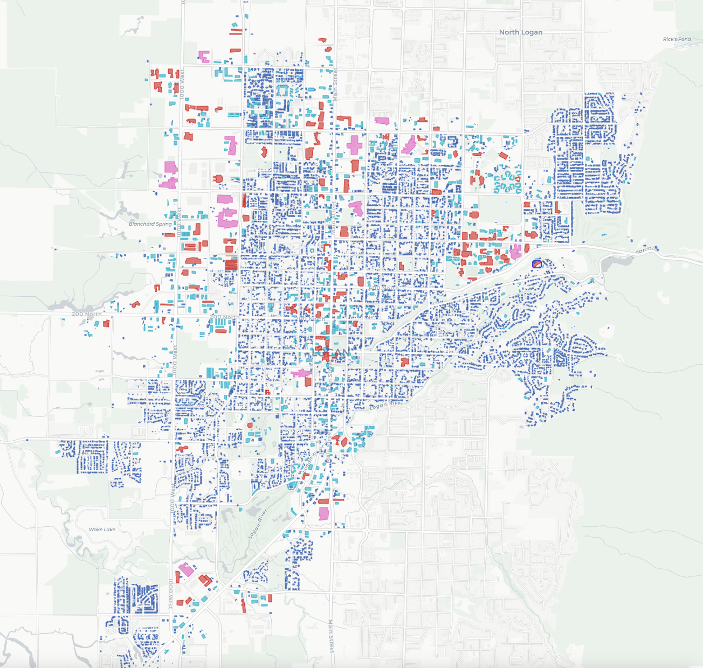
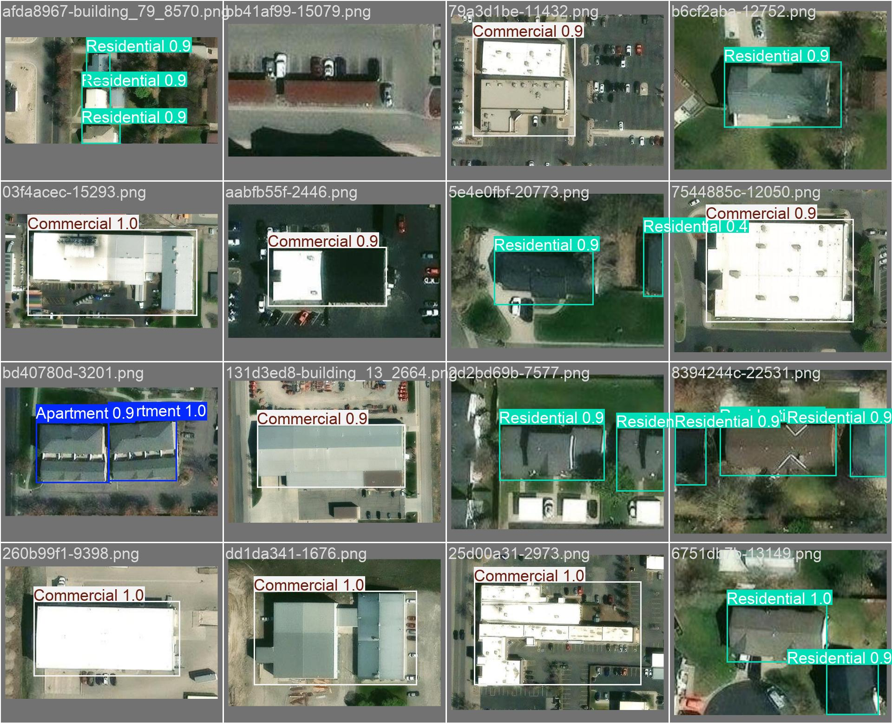
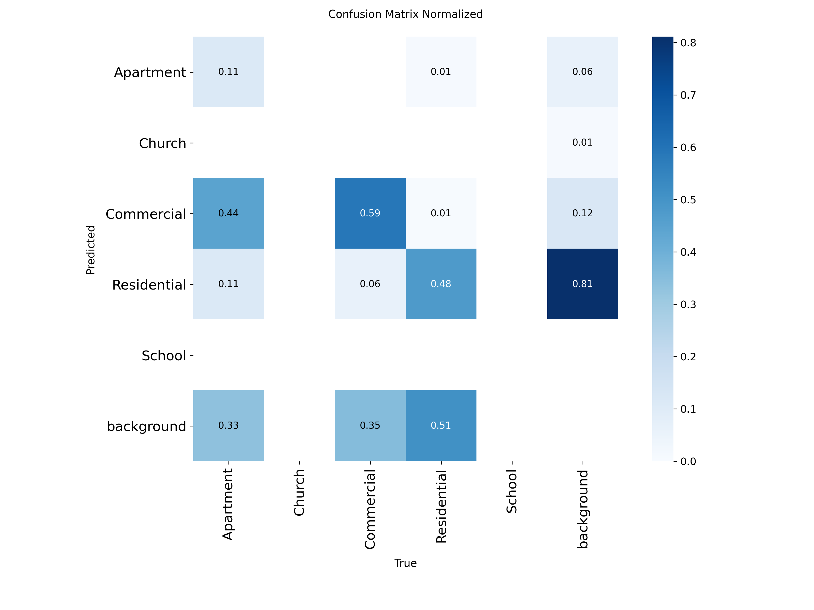
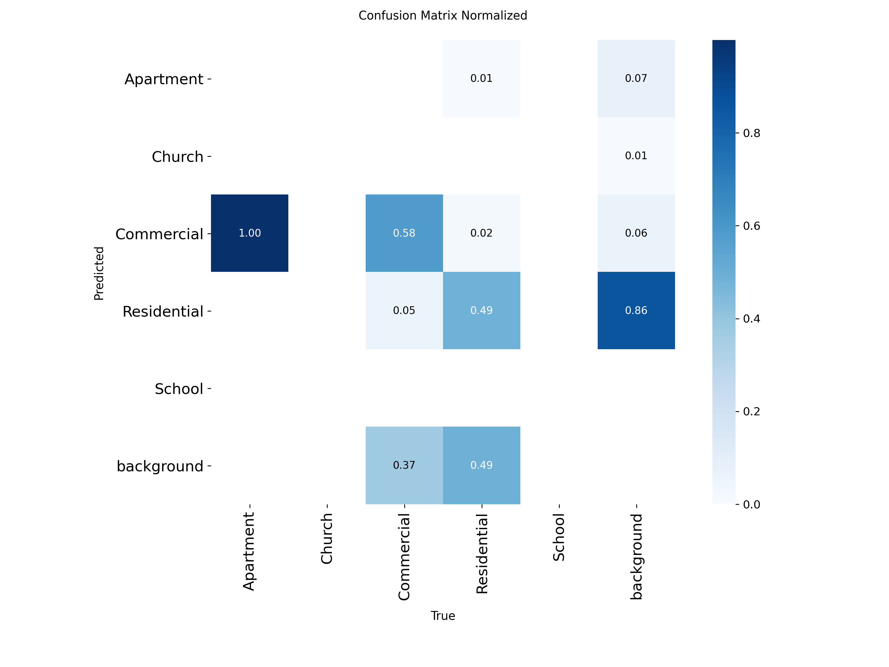

# Introduction
Travel forecasting models rely on land use data as a primary input. These data include the number of persons and households living in a given area, as well as other information relevant to travel behavior including the availability of motor vehicles, the income of the residents, and the presence of workers, students, and non-workers.
In many contexts, these data are assembled from government statistical agencies; in the United States common sources include the US Census Bureau and the Bureau of Labor Statistics [@nchrp]. 
In countries where data are available, these models are highly reliant on the consistent and public release of the data [@rohanna_census_2006]. 
In countries where statistical agencies are not reliable, travel forecasting models struggle to be developed or have data gaps [@abueisheh_trip_2024]. 
Inaccuracies resulting from such gaps or outdated data affect model accuracy. Previous studies have shown that the forecasts of travel models are highly sensitive to the accuracy of input data, with models in the United States showing a significant but modest bias towards over-predicting future traffic [@erhardt2020traffic].
The standard practice when high-quality data is not available locally is to transfer models and model parameters from another region or time period; success with this method can be limited is limited otherwise [@wilmot2001transferability; @bowman2017testing].

Recent research has sought to find alternative methods to collect local and timely land use characteristics. 
Satellite aerial imagery has been used to analyze the volume and density of man-made structures and roads to estimate area populations, in both urban and rural settings [@allaw_population_2020; @fibaek_multi-sensor_2021]. 
Daytime imagery has also been used to track vehicle movement between major cities as an indication of economic activity [@lehnert_proxying_2023]. 
Such imagery has also been used to classify land use by estimating landscape patterns and building functions, identifying different surfaces, and then categorizing building types [@zhang_landscape_2020]. 
Nighttime light data has also been shown to be useful as well. 
One study correlated city light output with socioeconomic variables such as population, GDP, and electric power consumption [@kamarajugedda_assessing_2017], while another used the light emitted from cars at night on highways to predict vehicle travel between cities [@chang_novel_2020]. 
Satellite imagery has also been used to produce datasets such as the Microsoft Building Footprints dataset, which has been used along with LiDAR and point of interest data to inventory residential structures from census data [@microsoft_globalmlbuildingfootprints_2026;@ye_enhancing_2024]. 
Unfortunately, processes and methods reliant on satellite data are also susceptible to the availability of said data, which, like statistical data, may not be available across the world or could have its public access revoked. 

More recent advances in machine learning have led to more applications of remote sensing data, including tracking vehicle movement between cities [@lehnert_proxying_2023], or predicting population characteristics and locations of man-made structures across entire countries [@fibaek_multi-sensor_2021]. 
Models such as Ultralytics' "You Only Look Once" (YOLO) model [@Jocher_Ultralytics_YOLO_2023] are being used to identify buildings and extract building footprints [@nurkarim_building_2023; @sharma_building_2023], a particularly useful application for travel forecasting model inputs. 
It is expected that as travel forecast and other datasets continue to grow larger the use of machine learning models for analysis will become increasingly relevant and practical.

Within the context of this background and research, the question arises as to whether and to what extent remote sensing data can be used to develop land use independently of statistical agencies.
The development of a process or method that could synthesize such data would solve many problems in places without reliable statistical data as well as supplement data in other places. 

In this paper, we present initial efforts to determine building type from building footprint data and aerial images of buildings. We do this by training a deep learning model on labeled data from Logan, Utah. 
We then apply this model to other cities in Utah to assess its viability in predicting building categories outside of the training data. The paper closes by discussing limitations and associated future research.

# Methodology
## Data Collection
{#fig-logan-clusters-map-plot width=100%}

We chose the city of Logan, Utah, for the initial analysis due to it being a smaller city and having a variety of building ages and types. 
Using the a bounding box defined by the extent of the city boundaries, all of the building footprints in the city were extracted from the Microsoft Building Footprints dataset [@microsoft_globalmlbuildingfootprints_2026]. 
The footprint area and perimeter were supplied to a $k$-means clustering algorithm to identify groups of buildings similar in size and shape.
@fig-logan-clusters-map-plot shows the allocation of structures to these groups, with the majority of structures being small residential buildings.

We also obtained aerial images for a sample of 600 buildings in Logan using the Python package Contextily [@contextily_software], an open-source program that retrieves satellite images from the Bing aerial image library, using bounding boxes to obtain small areas of the image tiles. 
Because the majority of the buildings were in the same cluster of small buildings, we oversampled 200 additional buildings from clusters that included only larger buildings. 

## Model Training
{#fig-YOLO-example width=100%}

Ultralytics' "You Only Look Once", or YOLO model, is an open-source object detection model [@Jocher_Ultralytics_YOLO_2023].
The model is trained on images that are manually labeled, or annotated with bounding boxes to identify specific categories desired for the model to detect. 
In preparation for training the YOLO model, we annotated the collected satellite images using the Python package Label Studio [@Label_Studio].
Label Studio is an open-source tool that makes it easy to manually label images for use in machine learning.
Student researchers manually labeled the images, sorting the buildings into five categories: Apartment, Residential, Commercial, Church, and School.
A random sample of 80% of the images was selected for model training, with the other 20% of the images reserved for model validation. 
Within these image sets, clusters that included larger and less common building sizes were specifically included, due to their relatively lower likelihood of appearing, to make sure the model would be trained on these less common building types. 
Despite this, building types such as schools and church buildings were still underrepresented and appeared only a few times, due to their relatively low number even within the cluster representing larger buildings. 

The YOLO model trains on the training images iteratively,
until it can consistently recognize the different categories in the pictures. 
The YOLO model then validates itself on the holdout sample of annotated images not included in the training set to ensure the accuracy of training. 
After the validation, the model is then able to predict categories in nonannotated images by bounding them in bounding boxes and displaying the probability of correct identification. 
@fig-YOLO-example shows an example of a YOLO model prediction output for a sample of buildings in the dataset.
The results of the validation can be seen in @fig-confusion-matrix-logan.

## Model Validation and Comparison
After this initial training on the Logan images, we tested the model's predictive capabilities on other cities in Utah to assess the model's viability in predicting building categories outside of the training sample.
We chose five test cities based on similarities and dissimilarities in median income and age of housing stock as recorded American Community Survey data, shown in @tbl-val-cities. 
We theorized that these factors would have a significant impact on the architecture of the house and therefore the YOLO model's ability to recognize and categorize them. 

::: {#tbl-val-cities .content-visible when-format="latex"}
\begin{table*}
\centering
\caption{Chosen Cities by Median Income and House Age}
\label{tbl-val-cities}
\renewcommand{\arraystretch}{1.3}
\begin{tabular}{lccccc}
\hline
House Age & High Income & Middle Income & Low Income  \\
\hline
Old Houses   & Bountiful, Utah    & Ogden, Utah        & Price, Utah         \\
New Houses & Saratoga Springs    & St. George, Utah         & (None)         \\
\hline
\end{tabular}
\end{table*}
:::

Following the same method as described above, we collected and clustered building footprint data for each city, 
randomly selecting and labeling 200 satellite images of buildings across building clusters.
These annotated images were then run through the model using the validation modules only.

# Results and Discussion
## Results From Logan, Utah

::: {#fig-confusion-matrix-logan layout-ncol=2 fig-env="figure*"}

{#fig-logan_cm width=100%}

{#fig-logan_cm_n width=100%}

YOLO confusion matrices for Logan, Utah.
:::

The results of the Logan trained YOLO model are shown in @fig-confusion-matrix-logan.
The desired output of the model is to have all the numbers in a diagonal line, indicating perfect prediction of the building's category in line with the annotated labels.
The confusion matrix shows that the model accurately identified residential buildings 99% of the time, and all commercial and apartment buildings.
However, it did underperform with churches (67%), likely due to the low number of images to train on. 

An important aspect of the model to discuss is when it predicts different building types where there is no building. 
This is seen on the far right of each graph, where "background" is given as the true value, but the model gave predictions from every category. 
This error comes from two sources. 
The first is due to how we made the annotations in the training of the model. 
Auxiliary buildings, such as backyard sheds, were not consistently identified and annotated, but the model still recognized them as buildings and categorized them. 
There were also times when only a small portion of a building was present in an image, and we believed it to be too little of the building for the model to pick up, and so we did not annotate it.
However, the model in some cases still recognized and categorized the building at a probability level, while in other cases it did not recognize partial buildings at all. 

The other source of error was from the quality of the photos used. The satellite images from Contextily were convenient and easy to access but were often low quality. 
This resulted in the model sometimes interpreting objects of solid colors, such as roads and covered parking structures, as a type of building. 
Between these errors, the second one could be solved using higher quality photos to help the model better distinguish between these surfaces. 
The first error could be improved by implementing better guidelines on the annotation process to ensure consistency between datasets. 
However, in practice, the first error may be less relevant if only the primary building in each image matters to be identified.

## Results From Other Utah Cities

::: {#fig-confusion-matrix-val-cities layout-ncol=2 layout-nrow=3 fig-env="figure*"}

{#fig-logan_cm width=100%}

{#fig-logan_cm_n width=100%}

{#fig-logan_cm width=100%}

{#fig-logan_cm_n width=100%}

{#fig-logan_cm width=100%}

{#fig-logan_cm_n width=100%}

Normalized YOLO confusion matrices
:::

When the Logan model was applied to other cities in Utah, it produced mixed results, as seen in @fig-confusion-matrix-val-cities. 
In every city the model struggled to correctly distinguish between the different building types. 
Most of the building images we annotated for these cities were residential housing; however, the model categorized residential buildings incorrectly 50% of the time, if not more.
Commercial and apartment buildings displayed worse results on average, with correct identification of 19% to 60%  and 0% to 50%,  respectively.
Church and school buildings, if they appeared in the datasets, were misidentified 100% of the time. 
While it seemed to do better in Saratoga Springs with residential buildings, its accuracy with other building types is still far too low to be useful. 
It remains unclear why Saratoga Springs' residential buildings were so well identified, with the city sharing little with Logan in respect to median income, house age, and location. 

The model also struggled with simply recognizing buildings at all. 
Each city had a significant number of buildings that were predicted as "background", meaning the model did not recognize them as buildings despite them being annotated. 
When we checked the building images, none of them had any characteristics, such as large trees or shadows partially covering the roof, that the Logan images did not also have. 
The quality of the images from Contextily are also likely not a factor, since they were the same across all the cities in Utah. 

While we thought that the median income or house age could also play a significant factor in the model's ability to recognize different building types, the results of the validations did not support this. 
The model performed roughly the same in every city it was not trained on. 
Neither house age nor median income made a difference in the model's ability to classify.
Further research is needed to identify what factors caused the model to perform so poorly on these cities. 

Given the results of the validations, we infer that developing a process for model creation would be more useful and viable than creating a universal model to be used in a region. 
It appears that building styles and types are unique enough between cities that a single unified model, at least one mostly dependent on identifying building roofs, is not feasible. Adding other environmental variables to the classification, such as the presence of sidewalks, swing sets, etc. could allow for a more general model to be developed. 

# Conclusion and Future Research
In this paper, we presented the results of using a machine learning model to classify building types from aerial imagery. 
We used building footprints in Logan, Utah, to collect building images and annotated them to train a YOLO model. 
That model was then tested on predicting building categories from other cities in Utah, in which it was not trained. 
We found that the model did well in identifying buildings in the city it was trained in but performed poorly when applied to other cities in Utah. 
There are several potential strategies that could improve this model in future research. 

A data element that could be useful in a general building identification model is information --- known or predicted --- on the types of buildings in the immediate vicinity.
In many contexts, the separation of land uses may strongly indicate the types of structures that could exist in a particular location. 
This would help in situations where a building may look residential, but is surrounded by warehouses, meaning it is likely some type of commercial support building. 
Variables based on nearby buildings could, however, run into issues in areas where mixed-use housing is common, or where residential and commercial buildings are more intertwined. 

A key challenge in this research was the quality of the images available through Bing, and the accuracy of the Microsoft building footprints. 
Although these datasets are expansive, they are not exhaustive and the quality and availability of data varies across jurisdictions. The datasets also tend to be a few years old, undermining their usefulness as a resource for rapidly developing areas. 

The rise of commercially available and affordable UAVs has improved the ability for individuals and small organizations to capture high-quality aerial imagery, with impacts in many fields [@colomina_unmanned_2014; @watts_unmanned_2012].
UAV-acquired imagery could allow the model to distinguish houses on a much finer level, which could help with the model's transferability. 
Another primary advantage of aerial drones vis-à-vis satellite imagery is the ability to capture images from multiple angles, which can be used to create a more complete picture and even a 3D model [@berrettLargeScaleRealityModeling2021].

Another direction future research could take would be to create a general model that would not only categorize a building but also be able to predict socioeconomic data for the building's household. 
Other variables could include the presence of objects that suggest socioeconomic status, such as vehicles, swing sets, and foliage around a house.
These variables would come from other YOLO models trained specifically to identify these objects. 
Other inputs for the model could come from other types of remote sensing data.
Data such as thermal radiation, nighttime light data, or vegetation index data could be used to predict statistics like income calculated from the household's heat use, light use, or amount of vegetation on a property.
This data, from heat use to the presence of cars, could also give insights on the number of people living within a household, or whether children are present. 
There are acknowledged privacy challenges with this potential data collection, with UAV-collected imagery challenging the boundary between public and private information [@hall_use_2021]. These concerns would need to be addressed in future research or clarified through additional regulation.

\balance

# References {#references .numbered}

